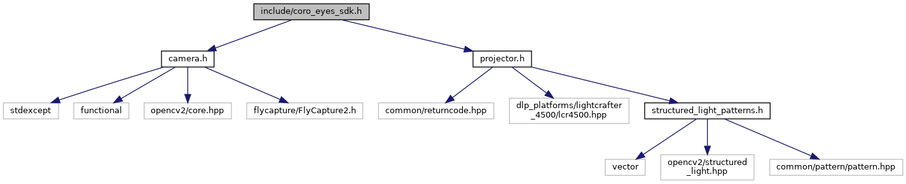

# coro_eyes_sdk

## Overview

SDK for a structured light 3D vision system using the TI LightCrafter 4500 EVM and Flir Flea3 camera(s) to generate point clouds.

### License

The source code is released under a [BSD 3-Clause license](coro_eyes_sdk/LICENSE).

<b>Author: Alexandre Bernier 
Affiliation: [CoRo, ÉTS](http://en.etsmtl.ca/unites-de-recherche/coro/accueil?lang=en-CA) 
Maintainer: Alexandre Bernier, ab.alexandre.bernier@gmail.com</b>

### Compatibility

The coro_eyes_sdk has been tested on Ubuntu 20.04 with the following dependency versions:

| Dependencies | Version |
| --- | --- |
| CMake | 3.21.3 |
| OpenCV | 4.2.0 |
| hidapi | 0.9.0 |
| libusb | 1.0.23 |
| udev | 245.4 |
| FlyCapture SDK | 2.13.3.31 |

## Installation

### Dependencies
- [OpenCV](https://opencv.org/)

      sudo apt install libopencv-dev

- [hidapi](https://github.com/libusb/hidapi)

      sudo apt install libhidapi-dev

- [libusb-1.0](https://libusb.info/)

      sudo apt install libusb-1.0-0-dev

- [libudev](https://manpages.debian.org/testing/libudev-dev/libudev.3.en.html)

      sudo apt install libudev-dev
    
- [FlyCapture SDK](https://www.flir.ca/products/flycapture-sdk/) 
    [<b>Download here</b>](https://flir.app.boxcn.net/v/Flycapture2SDK/folder/72274730742).
    The version for Ubuntu 18.04 works on Ubuntu 20.04. 
    Follow instructions [<b>here</b>](https://www.flir.ca/support-center/iis/machine-vision/application-note/getting-started-with-flycapture-2.x-and-linux/).           

### Building from source

    git clone https://github.com/alexandre-bernier/coro_eyes_sdk.git
    mkdir build
    cd build/
    cmake ..
    sudo cmake --build . --config Release --target install
    
### udev rules

Once udev is installed, you can run the [udev configuration script](install/configure_udev_rule.sh) with sudo to create the udev rules automatically.

    sudo install/configure_udev_rule.sh
    
### USBFS memory allocation

Make sure to run the [USBFS configuration script](install/configure_usbfs.sh) with sudo to increase the USBFS memory allocation (especially if you intend to run more than one camera at the same time).

    sudo install/configure_usbfs.sh
    
To verify that the script worked, restart your computer and run the following command in a terminal (you should see `1000` as a result):

    cat /sys/module/usbcore/parameters/usbfs_memory_mb

## Usage

### Header

Simply include coro_eyes_sdk.h in your code to get access to all the APIs.

### Documentation

Once you built the library (and if you have Doxygen installed), you will find the documentation at `doc/html/index.html`.

## Examples

You can find multiple examples on how to use this SDK in the `examples/` directory:

- examples/projector_example.cpp
- examples/camera_example.cpp
- examples/camera_calibration_example.cpp
- examples/structured_light_example.cpp
